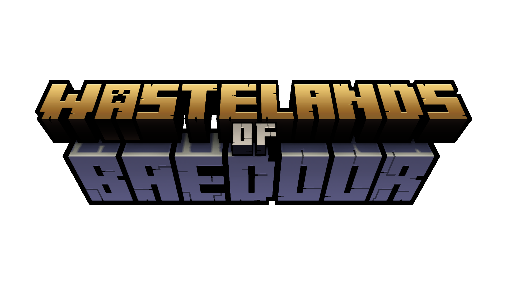

 

current version:  
**v0.a11s6**

 
 

---
**Wastelands of Baedoor** is Minecraft mod that aims to expand vanilla experience with 
steampunk influences, offering unique mix of adventure, farming and combat features.  
You can go on a trip to find new structures, airships, discover whole new weaponry
being guns, as well as other small vanilla+ enhancements to gameplay, such as extended
renewability of resources.

---

 🎎 Socials: 
  

<tr>
        <td colspan="2" align="center">
            
            
        </td>
</tr>

---

 ⚙️ Development Stages: 
  

Currently, Wastelands of Baedoor is in <b>open alpha</b>.   
However, considering its rewrite to full code in the future, contributors are asked
to wait for rewritten version to contribute.
  

---

 ✨️ Main Credits:  

<b>Code, idea, writing:</b> Toma400
 
<b>Textures:</b> Toma400, DylanVHS
 
<b>Models:</b> Toma400, TotalBlackSmith

  